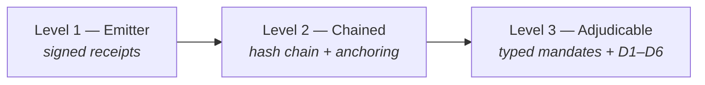

# Adopting the AIR Evidence Profile

The profile is free and open. This document is the shortest path from
"my agent transacts" to "my agent's transactions are evidence-grade" —
in three cumulative levels, so you get value at every step without
committing to the full stack on day one.



---

## Level 1 — Emitter *(an afternoon)*

**You emit cross-signed receipts for every transaction.**

What you implement:
- JCS canonicalization (no-float subset — reject floats, amounts in minor units).
- Ed25519 signatures over the canonical body excluding `signatures`.
- The receipt envelope (spec §9) with identity, terms, outcome.
- Counterparty co-signature where possible; witness (gateway) signature when
  one is in the path.

What you get: non-repudiation. Neither side can later dispute what was agreed.

```python
from air_evidence.receipt import build_receipt, build_terms, build_identity
from air_evidence.crypto import KeyPair, sign_object

receipt = build_receipt(mandate=..., prev_receipt_hash=None, seq=1,
                        identity=..., decision_context=..., terms=...,
                        outcome_status="settled", ...)
sign_object(receipt, role="agent", kid=agent_kid, keypair=agent_kp)
sign_object(receipt, role="counterparty", kid=cp_kid, keypair=cp_kp)
```

**Conformance:** spec §16 items 1 only (partial). You may state:
*"emits AIR evidence receipts (Level 1)"*.

## Level 2 — Chained *(a day)*

**Your receipts are tamper-evident and third-party verifiable.**

Add:
- `prev_receipt_hash` + monotonic `seq` per agent stream.
- Periodic Merkle anchoring — either run the reference log
  (`air_evidence.chain.ReceiptLog`) or point your stream at a shared log
  operator. Anchor roots to an RFC 3161 TSA (cheap) and/or a public ledger.
- Serve inclusion proofs.

What you get: deletion, reordering and post-hoc edits become detectable by
anyone, without trusting you. This is the difference between "we have
records" and "we have evidence".

**Conformance:** spec §16 items 1–3. State: *"Level 2 — chained and anchored"*.

## Level 3 — Adjudicable *(the real prize)*

**Claims about your agent resolve automatically.**

Add:
- Typed mandates (spec §4): translate the principal's instruction into the
  constraints object, present it back for confirmation, and have the
  principal sign **the constraints, not the prose**.
- `human_approval` blocks when the threshold constraint requires them.
- Run (or submit to) an adjudicator implementing D1–D6 with the exact
  failure codes and the fail-safe rule: unknown constraint → `INDETERMINATE`,
  never a silent pass.

What you get: within-mandate vs. exceeded-mandate stops being a negotiation
and becomes a computation. This is the level insurers, marketplaces and
arbitration care about.

**Conformance:** spec §16 items 1–5, full. State: *"conforms to
air-evidence/0.1"*.

---

## By role

| You are… | Start at | Your critical piece |
|---|---|---|
| **Agent operator / framework** | Level 1 → 3 | Typed-mandate UX: constraint confirmation before the principal signs |
| **Payment gateway / rail** | Level 1 (witness) | Co-sign every transaction you settle; include `rail_tx_ref` so evidence cross-verifies against your records |
| **Merchant / counterparty** | Level 1 | Co-sign terms — it protects you as much as the buyer |
| **Log operator / notary** | Level 2 | Anchoring cadence, inclusion + consistency proofs, retention tier |
| **Insurer / adjudicator / arbiter** | Level 3 (consume) | Run D1–D6 against submitted chains; require Level ≥2 from insureds |

## Interop expectations

- Two conforming implementations MUST produce byte-identical canonical forms
  and identical hashes for the same object. The repo ships a cross-language
  probe (Python ↔ JavaScript) you can extend with your stack.
- Unknown constraint fields are never ignored — that single rule is what
  keeps mixed-version ecosystems safe.

## Contributing

- **Feedback on Draft 1:** open an issue tagged `evidence-profile`.
- **Conformance vectors:** PRs adding signed test vectors (valid and
  deliberately broken) are the highest-value contribution right now.
- **0.2 agenda** (spec §15): sub-mandates for agent→agent delegation,
  hierarchical categories, amount-private receipts, standard claim-time
  disclosure. Sub-mandates is the headline item — if your use case involves
  agents delegating to agents, your input shapes it.
