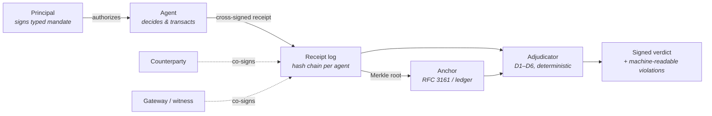
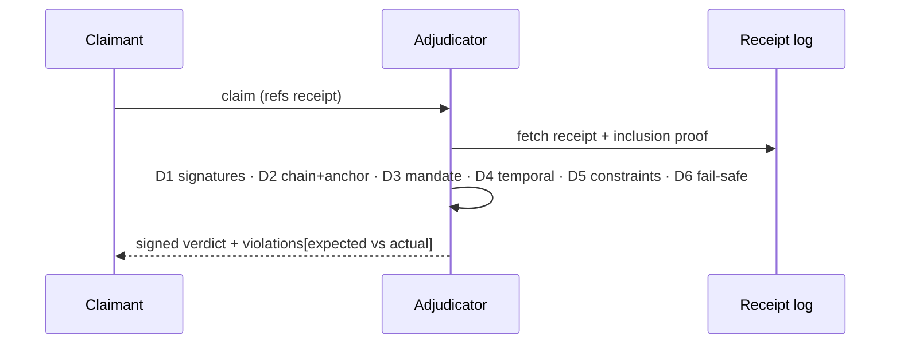

# AIR Evidence Profile


**The forensic evidence layer for agent transactions.** A profile over AIR
receipts defining the minimum evidence a transaction must carry to support a
liability claim — and a deterministic adjudicator that resolves those claims
as a pure function over signed data.

> Logs are testimony from an interested party. Evidence is signed by all
> parties at the moment of the event and immutable since. This profile
> specifies evidence.

**▶ [Try the live console](https://YOUR-USER.github.io/YOUR-REPO/)** — issue
receipts, anchor, tamper, file claims. All cryptography (Ed25519, SHA-256,
Merkle) runs locally in your browser; nothing leaves the page.

---

## How it works



Five evidence blocks per receipt (spec §4–§8):

| # | Block | Answers | Key mechanism |
|---|-------|---------|---------------|
| 1 | **Mandate** | What did the principal authorize? | Typed, machine-decidable constraints — prose kept only as hash |
| 2 | **Identity** | Which agent, software, operator? | DIDs + `config_hash` linking audited config to conduct |
| 3 | **Decision context** | What did the agent know? | Cryptographic commitment, no data disclosure |
| 4 | **Terms** | What was transacted? | Cross-signed by agent, counterparty, witness |
| 5 | **Outcome & chain** | What happened after? | Disputes, refunds, claims chain to the origin receipt |

## Claim adjudication



| Verdict | Meaning | Resolution |
|---|---|---|
| `WITHIN_MANDATE` | Agent acted inside authority | auto |
| `EXCEEDED_MANDATE` | Typed constraint(s) breached — listed with expected vs. actual | auto |
| `INVALID_EVIDENCE` | Signatures or content fail verification (tampering) | auto |
| `BROKEN_CHAIN` | Stream gap, fork, or missing anchor | auto |
| `MANDATE_MISMATCH` / `EXPIRED_MANDATE` | Wrong or out-of-window mandate | auto |
| `INDETERMINATE` | Unknown constraint → fail-safe | human review |

The share of claims that resolve automatically is governed by one variable:
**how much of the mandate is typed**. That is the load-bearing rule of the
profile (spec §4.1).

## Quickstart

```bash
cd reference
pip install cryptography fastapi uvicorn pytest httpx

python -m demo.simulate_claim   # the §13 incident, end to end
python -m pytest tests/ -q      # conformance suite (one test per verdict)
uvicorn air_evidence.api:app    # HTTP API + local console at /
```

Cross-language guarantee: the Python reference and the browser console
(`docs/core.js`) canonicalize and hash identically — same object, same
`sha256:…` in both. JCS (RFC 8785) restricted to a no-float subset: amounts
are integers in minor units, and the canonicalizer *rejects* anything else.

## Documents

- **[SPEC.md](./SPEC.md)** — the profile: conventions, evidence blocks,
  custody chain, adjudication algorithm, worked example, security
  considerations.
- **[ADOPTION.md](./ADOPTION.md)** — conformance levels and the shortest path
  to emitting evidence-grade receipts.
- **[reference/](./reference/)** — Python reference implementation, tests,
  demo, HTTP API.
- **[../../docs/](../../docs/)** — browser console (GitHub Pages).

## Status

Draft 1, open for implementor review. Open issues for 0.2 tracked in
[SPEC.md §15](./SPEC.md#15-open-issues-for-02) — sub-mandates (agent-to-agent
delegation) is the headline item. Feedback via issues and PRs welcome.
